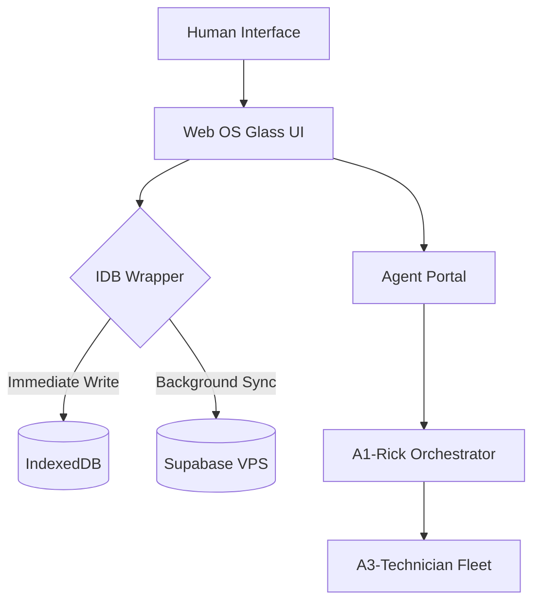

# 🌌 A'Space Life OS — Sovereign Web OS (2026)

> **"The Sovereignty of Memory, the Autonomy of the Future."**

Welcome to the **A'Space Life OS**, a next-generation, local-first development environment designed for absolute data sovereignty and AI-driven life management. Built upon the **BMAD Methodology**, this OS acts as your Digital Twin and Sovereign Command Center.

---

## 🏛️ Architecture: The Nexus Convergence

Life OS operates on a **Dual-Write Architecture**, ensuring your data is both ultra-fast (Local-First) and eternally durable (Global-Sync).

### 🛰️ The Fleet (Agent Strata)
- **A0 (Amadeus)**: The Visionary / Multiverse Architect (Strategic Oversight).
- **A1 (Rick)**: The CEO / Gatekeeper (Orchestration & PRD).
- **A2 (Doctors)**: The E-Myth Managers (ADR & DDD).
- **A3 (Technicians)**: The Executors (Ralph Loop & Implementation).

---

## 📂 Repository Structure

| Folder | Content | Role |
| :--- | :--- | :--- |
| [**`the-bridge-__-life-os/`**](./the-bridge-__-life-os/) | React 19 + Vite + Tailwind 4 | The Frontend Engine & Shell UI |
| [**`supabase/`**](./supabase/) | Config, Migrations & Seeds | The Persistence & Data Schema |
| [**`scripts/`**](./scripts/) | Utility & Automation | System Management |
| [**`REALITY_MAP.md`**](./REALITY_MAP.md) | Technical Specs | The Factual Source of Truth |

---

## 🚀 Deployment (Dokploy)

This OS is optimized for **Dokploy** deployment. 

1. **Dockerize**: Use the production [Dockerfile](./the-bridge-__-life-os/Dockerfile).
2. **Persistence**: Configure Supabase Stack on your VPS.
3. **Connect**: Inject `VITE_SUPABASE_URL` and `VITE_SUPABASE_ANON_KEY` via Dokploy ENV variables.

---

## 🛡️ Sovereignty & Security

- **Local-First**: Works entirely offline via IndexedDB.
- **Controlled Sync**: Supabase only receives what the Bridge allows.
- **Glassmorphism UI**: High-fidelity aesthetic designed for the "Wow Effect".

---

  <i>Developed with the Solarpunk Kernel — L0</i> 
  <b>Amadeuspace.com</b>

