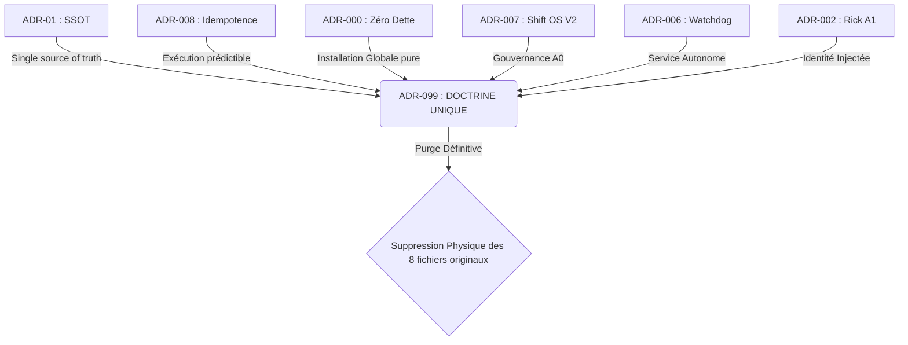

# STRATÉGIE D'EXPLORATION : FUSION VERS ADR-099 (ANTIFRAGILITÉ ABSOLUE)

> **Mode OpsX Explore :** Voici la réflexion stratégique pour consolider tes 8 ADRs/PRDs fragmentés et historiquement conflictuels en une Doctrine Unique et Infaillible (ADR-099), suivie d'une purge totale de la dette documentaire.

## 1. État des Lieux (La Dette Structurelle)

Actuellement, le système souffre d'une fragmentation cognitive s'étalant sur 8 documents qui se contredisent ou se superposent :

🔴 **Anciens paradigmes (A détruire)**
1. `ADR-01_OpenClaw-SSOT.md` (Obsolète, concept initial)
2. `ADR-002_Rick-A1-Kernel.md` (Trop granulaire, à abstraire)
3. `ADR-006_Idempotent-Startup-Notification.md` (Logique de startup locale)
4. `ADR-006_Persistance_Native_Watchdog.md` (Conflit de versionnage sur le 006)
5. `ADR-007_Paradigm_Shift_A_Space_OS_V2.md` (Transitionnal, n'a plus lieu d'être)
6. `ADR-008_OpenClaw_Idempotency.md` (Celui qui forçait les variables d'environnement locales `$env:`)
7. `ADR-000_Antifragilite_Zero_Dette.md` (Notre brouillon actuel)
8. `PRD-001_A_Space_OS_V2_Phase1.md` (Document Produit, obsolète face à OpenSpec)

## 2. Le Mapping de Fusion (L'ADN de l'ADR-099)

L'objectif est d'extraire la substantifique moelle de ces 8 documents pour la réinjecter dans un seul **ADR-099 : Souveraineté Globale & Antifragilité Zéro-Dette**.

## 3. Structure de l'ADR-099 (Master Doctrine)

Une fois fusionné, l'ADR-099 s'articulera UNIQUEMENT autour de ces 3 piliers immuables :

1. **Topologie Zéro-Dette**
   - Aucune variable `env` complexe.
   - Installation `npm install -g openclaw` pure.
   - Un seul fichier de vérité : `~/.openclaw/openclaw.json`.
2. **Idempotence d'Éxécution**
   - `openclaw gateway run` garantit un état propre, sans cache pollué, indépendamment du système hôte.
3. **Séparation des Contextes (Heartbeat Isolés)**
   - L'A0 Amadeus vit dans Telegram (`target: telegram`).
   - Le système vit silencieusement en fond (`lightContext: true`, `target: none`).

## 4. Protocole d'Exécution (La Purge)

Si cette stratégie te convient, voici les étapes d'exécution que je lancerai :

1. **Création** : Générer physiquement `C:\Users\amado\A'Space OS V2\00_Amadeus\01_Identity_Core\_SPECS\00_ADR\ADR-099_Doctrine_Antifragile.md` avec le contenu fusionné.
2. **Validation** : Tu valides du regard le nouveau document source.
3. **Annihilation** : Je supprime brutalement et définitivement les 8 anciens fichiers ADR (01 à 008) pour couper les ponts avec l'ancienne architecture.

---
*Ce document aide à visualiser le plan. Dès que tu es prêt, dis-le moi et je déclenche la fusion et la purge.*
